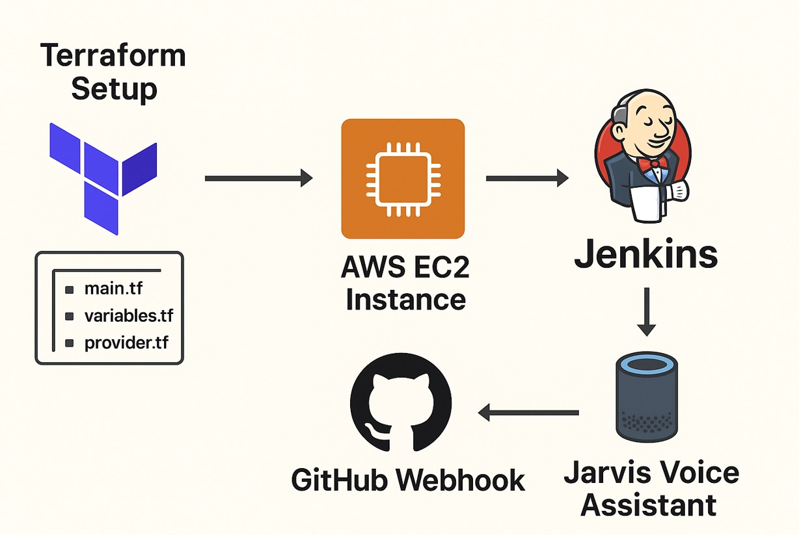
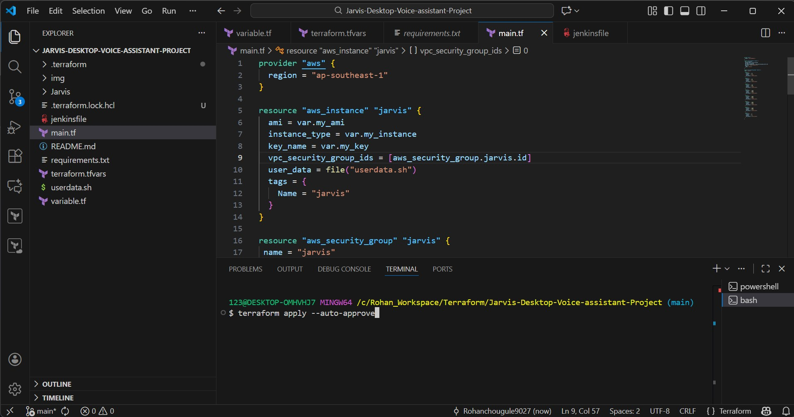
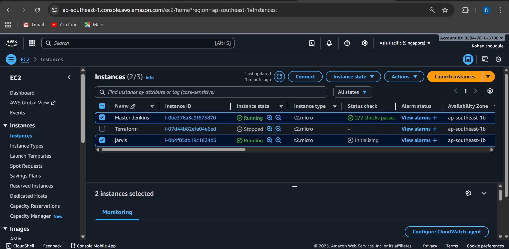
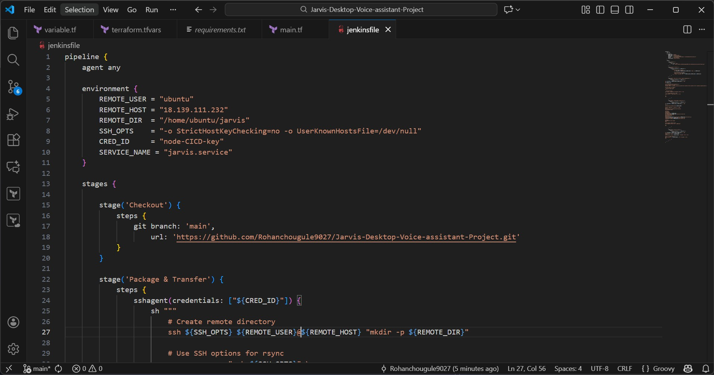
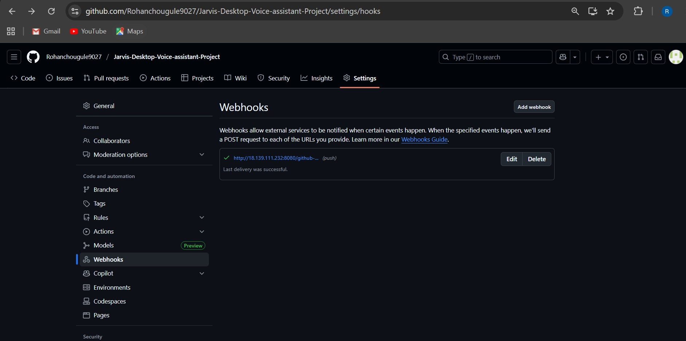
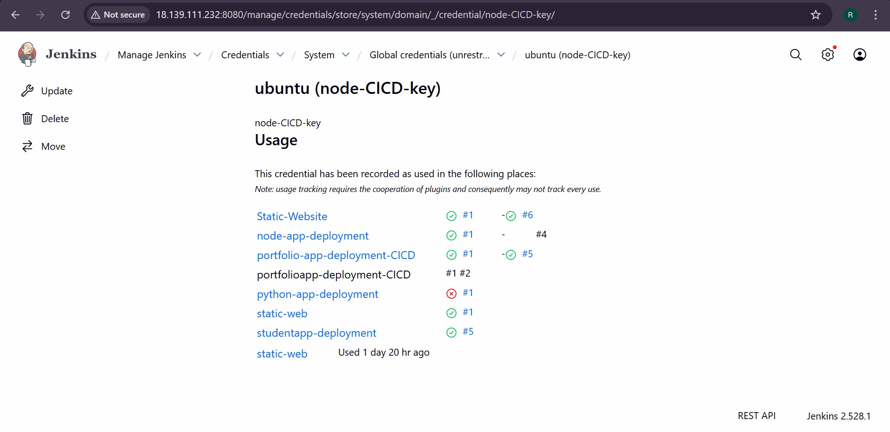
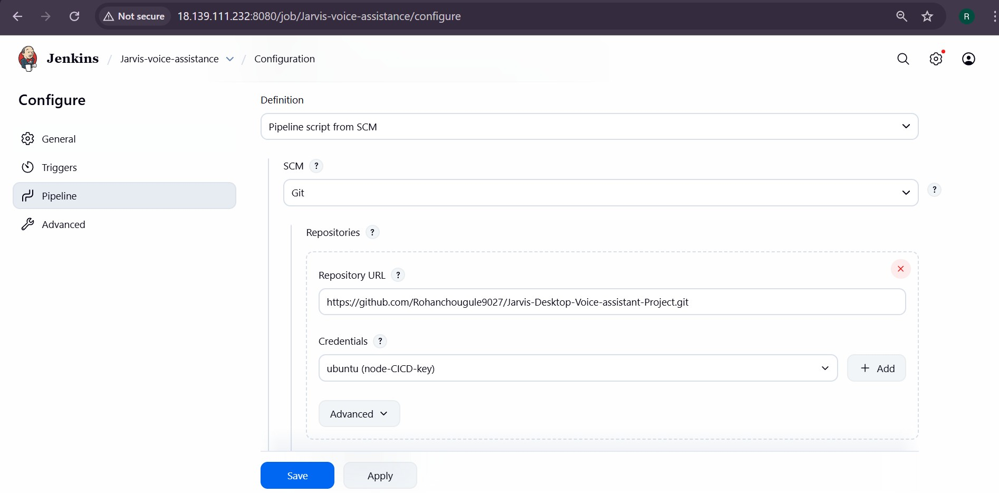
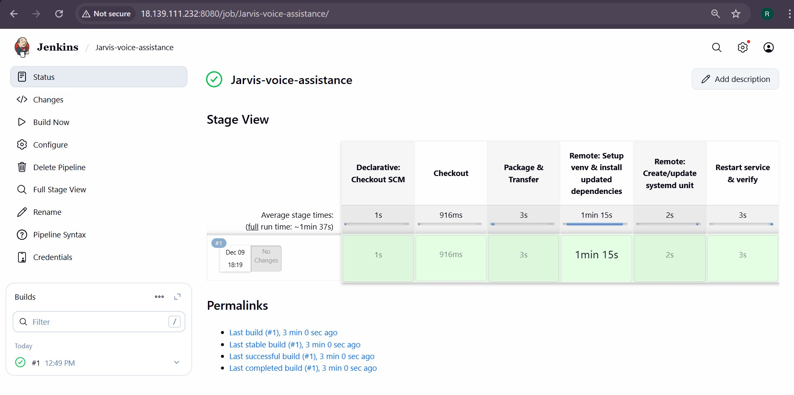

# 🚀 Terraform + Jenkins Deployment for Jarvis Voice Assistant

This project demonstrates how to deploy the Jarvis Desktop Voice Assistant on an AWS EC2 instance using Terraform for Infrastructure as Code (IaC) and Jenkins for CI/CD automation. Updates to the application are automatically triggered via GitHub Webhooks, ensuring seamless deployment.


---

### ⭐ Overview
This project automates complete deployment using:

1. Terraform → Create EC2 + Security Group + Setup\
2. EC2 Setup → Install Jenkins automatically\
3. GitHub + Jenkins → Webhook-based CI/CD\
4. SSH Credentials → Secure deployment\
5. Jenkins Pipeline → Auto-deploy Jarvis on push
---

### 🏗️ 1. Terraform Setup
**📁 File Structure**   
* `provider.tf`→ AWS region\
* `variables.tf` → Variables (ami, instance type, key, CIDR)\
* `main.tf` → EC2 + SG + KeyPair\
* `outputs.tf` → Output EC2 Public IP\
* `user_data.sh` → Bootstrap installation

**provider.tf**
```
provider "aws" {
  region = var.aws_region
}
```
**variables.tf**
```
variable "my_ami" {
  default = "ami-0c56f26c1d3277bcb"
}

variable "my_instance" {
  default = "t2.micro"
}

variable "my_key" {
    default = "jumpserver"
}

variable "user_data" {
  description = "Path to the user_data file"
}
```
**main.tf (Important parts)**
```
resource "aws_instance" "jarvis" {
  ami = var.my_ami
  instance_type = var.my_instance
  key_name = var.my_key
  vpc_security_group_ids = [aws_security_group.jarvis.id]
  user_data = file("userdata.sh")
  tags = {
    Name = "jarvis"
  }
}

resource "aws_security_group" "jarvis" {
 name = "jarvis" 

  ingress {
    from_port   = 22
    to_port     = 22
    protocol    = "tcp"
    cidr_blocks = ["0.0.0.0/0"]
  }

  ingress {
    from_port   = 80
    to_port     = 80
    protocol    = "tcp"
    cidr_blocks = ["0.0.0.0/0"]
  }

  ingress {
    from_port   = 443
    to_port     = 443
    protocol    = "tcp"
    cidr_blocks = ["0.0.0.0/0"]
  }

  ingress {
    from_port   = 5000
    to_port     = 5000
    protocol    = "tcp"
    cidr_blocks = ["0.0.0.0/0"]
  }

  ingress {
    from_port   = 8000
    to_port     = 8000
    protocol    = "tcp"
    cidr_blocks = ["0.0.0.0/0"]
  }

  ingress {
    from_port   = 8080
    to_port     = 8080
    protocol    = "tcp"
    cidr_blocks = ["0.0.0.0/0"]
  }

  ingress {
    from_port   = 9000
    to_port     = 9000
    protocol    = "tcp"
    cidr_blocks = ["0.0.0.0/0"]
  }

  egress {
    from_port   = 0
    to_port     = 0
    protocol    = -1
    cidr_blocks = ["0.0.0.0/0"]
  }
}
```

**user_data.sh (Example)**
```
#!/bin/bash
apt update -y
apt upgrade -y
apt install -y git python3 python3-venv python3-pip rsync curl openjdk-11-jdk

mkdir -p /home/ubuntu/jarvis
chown -R ubuntu:ubuntu /home/ubuntu/jarvis
```

**Example Terraform Execution:**
```
terraform init
terraform plan
terraform apply -auto-approve
```


---
### 🔑 2. Jenkins Installation on EC2
SSH into instance:
```
ssh -i key.pem ubuntu@PUBLIC_IP
```
Install Jenkins:
```
sudo apt update
sudo apt install -y openjdk-11-jdk
wget -q -O - https://pkg.jenkins.io/debian-stable/jenkins.io.key | sudo apt-key add -
sudo sh -c 'echo deb https://pkg.jenkins.io/debian-stable binary/ > /etc/apt/sources.list.d/jenkins.list'
sudo apt update
sudo apt install -y jenkins
sudo systemctl enable jenkins
sudo systemctl start jenkins
```
Access Jenkins:
```
http://PUBLIC_IP:8080
```
Initial Password:
```
sudo cat /var/lib/jenkins/secrets/initialAdminPassword
```

---
### 3. Adding Jenkinsfile to GitHub + Webhook Setup
Jenkinsfile Example



GitHub Webhook Setup
GitHub → Repo Settings → Webhooks → Add

Payload URL:
```
http://JENKINS_IP:8080/github-webhook/
```
Content Type: application/json Event: Push



---
### 4. Adding Credentials in Jenkins
Navigate:
Jenkins → Credentials → Global → Add Credentials
* Kind: SSH Username with Private Key
* Username: ubuntu
* Private Key: Paste your PEM
* ID: `node-CICD-key`



---
### 4. Deployment
Create Pipeline Job in Jenkins
* New Item → Pipeline
* Pipeline from SCM
* Repository: `https://github.com/you/Jarvis-Desktop-Voice-assistant-Project.git`
* Branch: `main`
* Script Path: `Jenkinsfile`


---

Click **Build Now**  
Webhook triggers build on new GitHub pushes.


---

### 🏁 Conclusion
This project demonstrates a fully automated, production-grade CI/CD workflow that combines the power of Terraform, AWS EC2, Jenkins, and GitHub Webhooks to deploy the Jarvis Desktop Voice Assistant seamlessly. By integrating Infrastructure-as-Code with continuous deployment, this setup ensures:

🔹 Zero manual server setup — Terraform handles all infrastructure

🔹 Automatic provisioning — EC2 bootstraps itself using user_data

🔹 Secure & repeatable deployments — Jenkins manages and executes pipelines

🔹 Instant updates — Every Git push triggers a fresh deployment on the EC2 server

🔹 Scalability & maintainability — Code-driven infrastructure and pipelines

Overall, the project delivers a reliable, modern, and scalable deployment pipeline suitable for real-world DevOps environments. It not only simplifies server management but also brings the Jarvis application to life with automation, speed, and efficiency—making it a complete end-to-end DevOps solution.